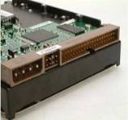
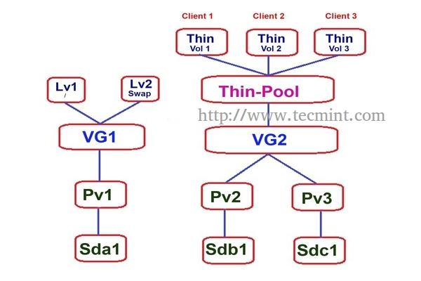

# 存储系统
- 存储设备
- 存储分类
- 存储协议


## 存储设备
- 磁盘控制器
- 硬盘
- HBA
- RAID


### 硬盘控制器
硬盘控制器即硬盘控制单元，是把计算机指令转化为硬盘动作的接口设备。硬盘控制器类型很多，但它的基本组成和工作原理大体上是相同的，它主要由与计算机系统总线相连的控制逻辑电路，微处理器，完成读出数据分离和写入数据补偿的读写数据解码和编码电路，数据检错和纠错电路，根据计算机发来的命令对数据传递，串并转换以及格式化等进行控制的逻辑电路，存放硬盘基本输入输出程序的只读存储器和用以数据交换的缓冲区等部分组成。
- 接收并解释计算机来的命令，向硬盘发出各种控制信号
- 检测硬盘状态，按照规定的硬盘数据格式，把数据写入硬盘和从硬盘读出数据


### 硬盘构造


### SSD
固态硬盘(SSD, Solid State Disk)是一种以内存作为永久存储的设备。


### SSD主要部件
1. 控制芯片
2. NAND芯片，
3. 电容，掉电保护，保证数据安全性
4. DRAM，缓存元数据
5. 对外接口，SATA/mSATA/PCI-E
6. NOR Flash，引导SSD


### SSD性能影响因素：
1. 主控，
2. NAND Flash，
  | Flash | Cell存储bit | 
    - SLC(Single Level Cell)，每个cell存储一个bit，寿命长性能好，军工级产品
    - MLC()，每个cell存储两个bit，容量大，一般用于企业级/消费级产品
    - TLC，每个cell存储三个bit，
3. 缓存


### SSD问题
- 掉速，速度随写入次数而降低


### 硬盘接口类型：
- IDE(Intergrated Device Electronic)，并口磁盘，ATA硬盘
- SATA(Serial ATA)，串行硬盘，在安装、传输速率、功耗、抗干扰方面有优势。
- SCSI(Small Computer System Interface)，相对于ATA支持更多接口数量，并行处理能力强，CPU占用率低。
- SAS(Serial Attached SCSI)，性能更高，向下兼容SATA。
- 光纤通道，优越的性能、稳定的传输。
- PCI-E
- mSATA


  


| 协议 | 速率 | 优点 | 缺点 |
|---|---|---|---|
| IDE | 133MB/s | 
| SATA II | 300MB/s |
| SATA III | 600MB/s |


工作模式：
- IDE模式，IDE兼容模式，SATA硬盘也支持。
- AHCI模式，高级控制器接口，支持热插拔、本地命令队列等高级功能。
- RAID模式，把多块硬盘组成一个硬盘组。


### HBA控制器
主机总线适配器(Host Bus Adapter,HBA)是一个在服务器和存储装置间提供输入/输出(I/O)处理和物理连接的电路板和/或集成电路适配器。
HBA的作用就是实现内部通道协议PCI和FC协议之间的转换。


### RAID控制器
RAID控制卡是一种磁盘阵列卡，它的核心就是RAID控制芯片。控制器采用PCI或PCIe卡的形式，这是为特定接口（比如SATA或SCSI）专门设计的。


## 存储类型
- 文件存储，文件访问接口
- 块存储，磁盘
- 对象存储，键值存储，接口GET、PUT、DELETE和其它扩展


存储方式	| 技术实现	| 优势	| 劣势 |	代表作
--|--|--|--|--
块存储 |	裸盘上划分逻辑卷，逻辑卷格式化成任意文件系统	| 支持多种文件系统，传输速度快，提供硬件容错机制	| 无法实现网络共享 |	FC-SAN，iSCSI
文件存储	| 在格式化的磁盘上存储文件 |	提供网络共享	| 网络传输速度制约读写速度，分层目录结构限制可扩展性 |	NFS，FAT，EXT3
对象存储	| 以灵活可定制的对象为存储单元，元数据服务器提供快速并发寻址	| 读写速度较快的同时支持网络共享，对象灵活定义|	管理软件的购买、使用和运维成本高	| Swift


## 存储协议
- SCSI
- iSCSI
- FC


## DAS
直连存储（Direct Attached Storage）
- 优点
 - 低费用
 - 安装、使用简单
- 缺点
 - 不能共享
 - 连接距离有限
 - 升级困难
 - 缺乏较好的高科用性
- 适用场景
 - 小型机构存储解决方案


## NAS
网络附加存储（Network Attached Storage）
- 优点
 - 低费用
 - 安装、维护简单
 - 共享数据
 - 跨平台文件共享
 - 远程访问
 - 减轻服务器负担
- 缺点
 - 孤立的存储设备
 - 传输速率低，可能成为瓶颈
 - 不适合数据库存储
- 适用场景
 - 文件存储解决方案


## SAN
存储区域网络（Storage Area Network），独立于LAN的服务器端存储专用网络。


### 核心设备
- 光纤通道交换机（FC Switch）
- 光纤通道卡（FC HBA），提供服务器或工作站连接到存储网络的接口
- 存储服务器，


- 优点
 - 传输速度快，传输距离远
 - 高级特性
- 缺点
 - 孤立的存储设备


- 应用场景
 - 基于文件和数据块的中高端存储解决方案
 - LanFree Backup
 - ServerLess Backup
 - 集群（可实现多节点）
 - 服务器/应用系统存储整合
 - 异地灾备
 - 同步与异步镜像
 - 分级存储（HSM）


## SAN与NAS区别
NAS：提供文件服务
SAN：提供块设备服务


## iSCSI


### SCSI系统
SCSI是一套完整的数据传输协议，其主要功能是在主机和存储设备之间传送命令、状态和块数据。操作系统对外部设备（如磁盘、磁带、光盘、打印机等）的I/O操作均可以通过SCSI协议来实现，一般情况下，SCSI协议都嵌入到设备驱动器或者主机适配器的板载逻辑中。


- SCSI Initiator，发起SCSI会话的一端，发送SCSI命令。
- SCSI Target，等待Initiator的命令，提供传输数据。通常向Initiator提供一个或多个LUNs。


### iSCSI协议
iSCSI是IETF提出的经TCP/IP/以太网传送SCSI指令的协议。
- iSCSI 协议经由TCP/IP协议栈（在IP之上的第四层< 传输>）传送本地SCSI命令及数据。
- 通过iSCSI协议，标准的SCSI命令和数据将被封装成一个以iSCSI头在先的连续字节串，该字节串被送到TCP/IP层，并被分解成适合网络传输的数据组后，交给主机和适用与iSCSI协议的存储设备
- 如果发出一个读数据的请求，则从物理磁盘中检索出数据，将其重新封装成iSCSI字节串后送到提出请求的主机
- 整个过称对用户和文件系统是透明的


### 优点
- 可连接性能超群，基于现有以太网络架构，可自然扩充到LAN、MAN、WAN，是远程数据传输的最佳方案。
- 提供与FC同级别的高可用
- 可加强的性能及高可用性、扩展性
- 虚拟存储与集中管理，易于整合
- 低整体成本
- 超远传输距离


### iSCSI Target
- 存储
- Target 软件
 - Lio
 - Tgt


### Addressing
- Portal(ip:port)，如10.0.20.1:3260
- IQN(iSCSI Qualified Name)，
    - iqn.<yyyy-mm>.<domain name>.<Optional>
- LUN(Logic Unit Number)，独立可访问的SCSI设备
- CHAP，认证


### Target 管理
- [存储管理界面](http://10.1.39.200/)


- LUN映射


### iSCSI Initiator基本操作
- 发现
```
[root@host18 ~]# iscsiadm -m discovery -t st -p 10.0.20.1:3260 
10.0.10.1:3260,1 iqn.2012-07.com.Sugon:alias.tgt0000.200000015555ee0d
10.0.20.1:3260,1 iqn.2012-07.com.Sugon:alias.tgt0000.200000015555ee0d
10.0.30.1:3260,1 iqn.2012-07.com.Sugon:alias.tgt0000.200000015555ee0d
10.0.40.1:3260,1 iqn.2012-07.com.Sugon:alias.tgt0000.200000015555ee0d
10.0.50.1:3260,2 iqn.2012-07.com.Sugon:alias.tgt0000.200000015555ee0d
10.0.60.1:3260,2 iqn.2012-07.com.Sugon:alias.tgt0000.200000015555ee0d
172.16.22.70:3260,2 iqn.2012-07.com.Sugon:alias.tgt0000.200000015555ee0d
10.0.80.1:3260,2 iqn.2012-07.com.Sugon:alias.tgt0000.200000015555ee0d
```


- 登录
```
[root@host18 ~]# iscsiadm -m node -T iqn.2012-07.com.Sugon:alias.tgt0000.200000015555ee0d -p 10.0.20.1:3260 -l
Logging in to [iface: default, target: iqn.2012-07.com.Sugon:alias.tgt0000.200000015555ee0d, portal: 10.0.20.1,3260] (multiple)
Login to [iface: default, target: iqn.2012-07.com.Sugon:alias.tgt0000.200000015555ee0d, portal: 10.0.20.1,3260] successful.
```


- 查看
```
[root@host18 ~]# iscsiadm -m session -P 3
iSCSI Transport Class version 2.0-870
version 6.2.0.873-30
Target: iqn.2012-07.com.Sugon:alias.tgt0000.200000015555ee0d (non-flash)
	Current Portal: 10.0.40.1:3260,1
	Persistent Portal: 10.0.40.1:3260,1
		**********
		Interface:
		**********
		Iface Name: default
		Iface Transport: tcp
		Iface Initiatorname: iqn.1994-05.com.redhat:a2c67b44fbb2
		Iface IPaddress: 10.0.20.18
		Iface HWaddress: <empty>
		Iface Netdev: <empty>
		SID: 2
		iSCSI Connection State: LOGGED IN
		iSCSI Session State: LOGGED_IN
		Internal iscsid Session State: NO CHANGE
		*********
		Timeouts:
		*********
		Recovery Timeout: 5
		Target Reset Timeout: 30
		LUN Reset Timeout: 30
		Abort Timeout: 15
		*****
		CHAP:
		*****
		username: <empty>
		password: ********
		username_in: <empty>
		password_in: ********
		************************
		Negotiated iSCSI params:
		************************
		HeaderDigest: None
		DataDigest: None
		MaxRecvDataSegmentLength: 262144
		MaxXmitDataSegmentLength: 262144
		FirstBurstLength: 262144
		MaxBurstLength: 524288
		ImmediateData: No
		InitialR2T: Yes
		MaxOutstandingR2T: 1
		************************
		Attached SCSI devices:
		************************
		Host Number: 9	State: running
		scsi9 Channel 00 Id 0 Lun: 0
			Attached scsi disk sdo		State: running
		scsi9 Channel 00 Id 0 Lun: 1
			Attached scsi disk sdq		State: running
		scsi9 Channel 00 Id 0 Lun: 10
			Attached scsi disk sdak		State: running
		scsi9 Channel 00 Id 0 Lun: 11
			Attached scsi disk sdam		State: running
		scsi9 Channel 00 Id 0 Lun: 12
			Attached scsi disk sdao		State: running
		scsi9 Channel 00 Id 0 Lun: 13
			Attached scsi disk sdaq		State: running
		scsi9 Channel 00 Id 0 Lun: 14
			Attached scsi disk sdas		State: running
		scsi9 Channel 00 Id 0 Lun: 15
			Attached scsi disk sdau		State: running
		scsi9 Channel 00 Id 0 Lun: 16
			Attached scsi disk sdaw		State: running
		scsi9 Channel 00 Id 0 Lun: 2
			Attached scsi disk sds		State: running
		scsi9 Channel 00 Id 0 Lun: 3
			Attached scsi disk sdu		State: running
		scsi9 Channel 00 Id 0 Lun: 4
			Attached scsi disk sdw		State: running
		scsi9 Channel 00 Id 0 Lun: 5
			Attached scsi disk sdz		State: running
		scsi9 Channel 00 Id 0 Lun: 6
			Attached scsi disk sdab		State: running
		scsi9 Channel 00 Id 0 Lun: 7
			Attached scsi disk sdad		State: running
		scsi9 Channel 00 Id 0 Lun: 8
			Attached scsi disk sdaf		State: running
		scsi9 Channel 00 Id 0 Lun: 9
			Attached scsi disk sdah		State: running
```


- 退出
```
[root@host18 ~]# iscsiadm -m node -T iqn.2012-07.com.Sugon:alias.tgt0000.200000015555ee0d -p 10.0.20.1:3260 -u
Logging out of session [sid: 1, target: iqn.2012-07.com.Sugon:alias.tgt0000.200000015555ee0d, portal: 10.0.20.1,3260]
Logout of [sid: 1, target: iqn.2012-07.com.Sugon:alias.tgt0000.200000015555ee0d, portal: 10.0.20.1,3260] successful.
```


## FCP

FC(Fibre Channel)是一种高速网络互联技术（2、4、8、16Gbps），主要用于连接计算机存储设备。
FCP(Fibre Channel Protocol)光纤通道协议是一种类似于TCP的传输协议，通过光纤通道上传输SCSI命令。


## 单模与多模
- 单模，芯径9-10微米，最大传输10km，成本高


- 多模，芯径50-62.5微米，


# LVM
逻辑卷管理（LVM，Logical Volume Manager）是Linux下的一种磁盘/分区管理器
- PV(Physical Volume)物理卷，物理磁盘分区或相同功能的设备。
- VG(Volume Group)卷组，由一个或多个PV组成
- LV(Logic Volume)逻辑卷，建立在VG之上


## 逻辑卷操作
- 创建
```
[root@host18 ~]# pvcreate  /dev/mapper/mpaths
[root@host18 ~]# vgcreate b9d8935c-8ee6-4f07-b052-3286224edbf4 /dev/mapper/mpaths
[root@host18 ~]# lvcreate -L 2G -n test1 b9d8935c-8ee6-4f07-b052-3286224edbf4
  Logical volume "test1" created.
```


- 查看
```
[root@host18 ~]# pvs
  PV                 VG                                   Fmt  Attr PSize   PFree  
  /dev/mapper/mpaths b9d8935c-8ee6-4f07-b052-3286224edbf4 lvm2 a--  179.97g 179.47g
  /dev/sda2          centos                               lvm2 a--  558.42g      0 
```
```
[root@host18 ~]# vgs
  VG                                   #PV #LV #SN Attr   VSize   VFree  
  b9d8935c-8ee6-4f07-b052-3286224edbf4   1   1   0 wz--n- 179.97g 179.47g
  centos                                 1   3   0 wz--n- 558.42g      0 
```
```
[root@host18 ~]# lvs b9d8935c-8ee6-4f07-b052-3286224edbf4
  LV         VG                                   Attr       LSize   Pool Origin Data%  Meta%  Move Log Cpy%Sync Convert
  test1      b9d8935c-8ee6-4f07-b052-3286224edbf4 -wi-a-----   2.00g                                                    
  vserver_ha b9d8935c-8ee6-4f07-b052-3286224edbf4 -wi-a----- 512.00m   
```


```
[root@host18 ~]# lvdisplay b9d8935c-8ee6-4f07-b052-3286224edbf4/vserver_ha
  --- Logical volume ---
  LV Path                /dev/b9d8935c-8ee6-4f07-b052-3286224edbf4/vserver_ha
  LV Name                vserver_ha
  VG Name                b9d8935c-8ee6-4f07-b052-3286224edbf4
  LV UUID                HKtt3P-SM09-WNYl-K7m2-KEHi-8ZEf-bcuzX4
  LV Write Access        read/write
  LV Creation host, time vs-test-91, 2016-05-18 10:24:02 +0800
  LV Status              available
  # open                 0
  LV Size                512.00 MiB
  Current LE             16
  Segments               1
  Allocation             inherit
  Read ahead sectors     auto
  - currently set to     256
  Block device           253:43
```


-快照
```
[root@host18 ~]# lvcreate -s -L 2G -n test1-snap b9d8935c-8ee6-4f07-b052-3286224edbf4/test1
  Logical volume "test1-snap" created.
[root@host18 ~]# lvdisplay b9d8935c-8ee6-4f07-b052-3286224edbf4/test1-snap
  --- Logical volume ---
  LV Path                /dev/b9d8935c-8ee6-4f07-b052-3286224edbf4/test1-snap
  LV Name                test1-snap
  VG Name                b9d8935c-8ee6-4f07-b052-3286224edbf4
  LV UUID                tJHX3A-AqFb-Hh17-2UII-udW6-Ip1s-9Y68hj
  LV Write Access        read/write
  LV Creation host, time host18, 2016-05-19 10:54:03 +0800
  LV snapshot status     active destination for test1
  LV Status              available
  # open                 0
  LV Size                2.00 GiB
  Current LE             64
  COW-table size         2.00 GiB
  COW-table LE           64
  Allocated to snapshot  0.00%
  Snapshot chunk size    4.00 KiB
  Segments               1
  Allocation             inherit
  Read ahead sectors     auto
  - currently set to     256
  Block device           253:49
```


- 删除
```
[root@host18 ~]# lvremove b9d8935c-8ee6-4f07-b052-3286224edbf4/test1
Do you really want to remove active logical volume test1? [y/n]: y
  Logical volume "test1" successfully removed
```


- 激活
- 扩展
- 减小


##精简格式
瘦供给（Thin Provisioning），创建一个精简LVM池，从中分配超过池容量的卷。



# 文件系统

文件是已建立索引的块的序列。块从索引节点映射到它们所代表的文件的逻辑偏移量。


## 分区
- mbr
- gpt


## 文件系统
- 本地文件系统
- 网络文件系统
- 集群文件系统
- 分布式文件系统
注：由于理解角度不同，集群与分布式文件系统定义不同。


### 本地文件系统
单机文件系统，用于操作系统和应用程序的本地存储。
- 典型代表： EXT、XFS、NTFS、FAT，
- 缺点：数据无法在服务器之间共享


### 网络文件系统
基于现有以太网架构，实现不同服务器之间传统文件系统数据共享。
- 典型代表： NFS、CIFS，
- 缺点：两台服务器不能同时访问修改，性能有限


### 集群文件系统
在共享存储基础上，通过集群锁，实现不同服务器能够共用一个传统文件系统。
- 典型代表：GFS（Redhat）、GFS2（Redhat）、OCFS（Oracle）
- 缺点：性能一般，扩展性很有限（小于16台服务器）


### 分布式文件系统
在传统文件系统上，通过额外模块实现数据跨服务器分布，并且自身集成raid保护功能，可以保证多台服务器同时访问、修改同一个文件系统。性能优越，扩展性很好，成本低廉。
-典型代表：lustre（Oracle）、HDFS（ASF）、gluster（Redhat）、Ceph（Redhat）
- 缺点：适用场景单一，部分类型存在单点故障风险。
- 主要分两大类型：一种是元数据集中管理模型；另一种是元数据分散管理模型


### HDFS
HDFS是元数据集中管理典型代表。实际数据分布存放在数据服务器上，元数据服务器负责IO请求调配，空间分配；非常适用于大文件存储。


### GlusterFS
gluster是元数据分散管理模型典型代表，元数据被分散放置到所有服务器上，不存在元数据单点故障。非常适用于小文件存储。


## 稀疏文件
具有一个或多个未映射到数据块的索引的文件称为稀疏分配或稀疏文件。稀疏文件将有一个与之相关的大小，但是它将不会有分配用于满足大小需求的所有数据块。


# RAID
独立硬盘冗余阵列（RAID, Redundant Array of Independent Disks），旧称廉价磁盘冗余阵列（Redundant Array of Inexpensive Disks），简称磁盘阵列。其基本思想就是把多个相对便宜的硬盘组合起来，成为一个硬盘阵列组，使性能达到甚至超过一个价格昂贵、容量巨大的硬盘。根据选择的版本不同，RAID比单颗硬盘有以下一个或多个方面的好处：增强数据集成度，增强容错功能，增加处理量或容量。另外，磁盘阵列对于电脑来说，看起来就像一个单独的硬盘或逻辑存储单元。分为RAID-0，RAID-1，RAID-1E，RAID-5，RAID-6，RAID-7，RAID-10，RAID-50，RAID-60。


## 总结
- RAID-1提供比较好的读写性能，
- RAID-5读性能不错，但是写入性能就不如RAID-1，
- RAID-6保护级别更高，但写性能相对更加差，
- RAID10是提供最好的性能和数据保护，不过成本最高


## RAID-5 写惩罚
写惩罚（Write Penalty）：条带上任意磁盘上的数据改变，都会重新计算校验位，从而影响写性能。
1. 读取原数据0110，然后与新的数据1111做XOR操作： 0110 XOR 1111 = 1001
2. 读取原有的校验位0010
3. 用第一步算出的数值与原校验位再做一次XOR操作： 0010 XOR 1001 = 1011
4. 然后将1111新数据写入到数据磁盘，将第三步计算出来的新的校验位写入校验盘。


## 不同RAID级别的写惩罚
- RAID-0：直接的条带，数据每次写入对应物理磁盘上的一次写入
- RAID-1和10：RAID-1 和RAID-10的写惩罚很简单理解，因为数据的镜像存在的，所以一次写入会有两次。
- RAID-5：RAID-5由于要计算校验位的机制存在，需要读数据、读校验位、写数据、写校验位四个步骤，所以RAID-5的写惩罚值是4。
- RAID-6：RAID-6由于有两个校验位的存在，与RAID-5相比，需要读取两次校验位和写入两次校验位，所以RAID-6的写惩罚值是6。
RAID Level | Write Penalty
0 | 1
1 | 2
5 | 4
6 | 6
10 | 2


## 计算IOPS

>物理磁盘总的IOPS = 物理磁盘的IOPS × 磁盘数目 
>可用的IOPS = （物理磁盘总的IOPS × 写百分比 ÷ RAID写惩罚） + （物理磁盘总的IOPS × 读百分比）

     假设组成RAID-5的物理磁盘总共可以提供500 IOPS，使用该存储的应用程序读写比例是50%/50%，那么对于前端主机而言，实际可用的IOPS是：
（500 ×50% ÷ 4）+ ( 500 * 50%) = 312.5 IOPS


# 虚拟磁盘


## 镜像格式
### RAW
优点：
简单，可移植性好。
缺点：
占磁盘空间，不支持快照。


### QCOW
它也是可以用一个文件的形式来表示一块固定大小的块设备磁盘。与普通的 raw 格式的镜像相比，有以下特性：
- 更小的空间占用，即使文件系统不支持空洞(holes)；
- 支持写时拷贝（COW, copy-on-write），镜像文件只反映底层磁盘的变化；
- 支持快照（snapshot），镜像文件能够包含多个快照的历史；
- 可选择基于 zlib 的压缩方式
- 可以选择 AES 加密


### VMDK
VMWare


### VHD
VHD/VHDX 是HyperV 适用的虚拟磁盘格式，支持COW。


## 缓存格式

| Caching Options | 描述 | 适用场景 |
|---|---|---|
| none | 虚拟机I/O不在主机上缓存，但可能在writeback模式硬盘缓存上|大量I/O请求，支持迁移 | 
| writethrough |虚拟机I/O缓存在主机，同时也写入物理介质 | 少量I/O请求 |
| writeback |虚拟机I/O缓存在主机 | | 


## 虚拟磁盘控制器
- IDE
- Virtio


### IDE
完全软件模拟的传统PC存储控制器。
- 优点：
无需安装额外驱动，兼容性好
- 缺点：
性能差


### Virtio
半虚拟化的磁盘控制器，让虚拟机的操作系统与内核的虚拟化层直接通信。

优点：
- 性能好
缺点：
- 操作系统需要安装额外驱动。


# 多路径
作用：
- 冗余，A/P模式，使用一半的路径，当前路径出现故障即切换到备选路径。
- 提高性能，A/A模式，I/O以round-robin方式通过所有路径。


## SAN故障点：
- HBA
- FC线
- SAN交换机
- 阵列控制器端口


## 多路径软件
- multipathd，基于device-mapper
- UltraPath，


## multipath常用命令
加载多路径模块
```
[root@host18 ~]# modprobe dm_multipath
```

配置多路径
```
[root@host18 ~]# cp /usr/share/doc/device-mapper-multipath-0.4.9/multipath.conf /etc/multipath.conf
```


启动多路径服务
```
[root@host18 ~]# systemctl start multipathd
```


格式化多路径
```
[root@host18 ~]# multipath -v2
```


查看多路径信息
```
[root@host18 ~]# multipath -ll
mpathr (222ed0001554cc6c9) dm-14 Sugon   ,DS600 G10       
size=180G features='0' hwhandler='0' wp=rw
`-+- policy='round-robin 0' prio=1 status=active
  |- 9:0:0:8   sdaf 65:240 active ready running
  |- 10:0:0:8  sdan 66:112 active ready running
  `- 11:0:0:8  sdk  8:160  active ready running
mpathe (22204000155d0f409) dm-12 Sugon   ,DS600 G10       
size=150G features='0' hwhandler='0' wp=rw
`-+- policy='round-robin 0' prio=1 status=active
  |- 9:0:0:10  sdak 66:64  active ready running
  |- 10:0:0:10 sdar 66:176 active ready running
  `- 11:0:0:10 sdm  8:192  active ready running
```


清除多路径
```
[root@host18 ~]# multipath -F
```


# 分布式存储


## 分布式存储系统特点：
- 可扩展 。分布式存储系统可以扩展到几百台甚至几千台的集群规模，而且，随着集群规模的增长，系统整体性能表现为线性增长。
- 低成本 。分布式存储系统的自动容错、自动负载均衡机制使其可以构建在普通PC 机之上。另外，线性扩展能力也使得增加、减少机器非常方便，可以实现自
动运维。
- 高性能 。无论是针对整个集群还是单台服务器，都要求分布式存储系统具备高性能。
- 易用 。分布式存储系统需要能够提供易用的对外接口，另外，也要求具备完善的监控、运维工具，并能够方便地与其他系统集成


## 分布式存储系统主要技术：

- 数据分布 ：如何将数据分布到多台服务器才能够保证数据分布均匀?数据分布到多台服务器后如何实现跨服务器读写操作?
- 一致性 ：如何将数据的多个副本复制到多台服务器，即使在异常情况下，也能够保证不同副本之间的数据一致性?
- 容错 ：如何检测到服务器故障?如何自动将出现故障的服务器上的数据和服务迁移到集群中其他服务器?
- 负载均衡 ：新增服务器和集群正常运行过程中如何实现自动负载均衡?数据迁移的过程中如何保证不影响已有服务?
- 事务与并发控制 ：如何实现分布式事务?如何实现多版本并发控制?
- 易用性 ：如何设计对外接口使得系统容易使用?如何设计监控系统并将系统的内部状态以方便的形式暴露给运维人员?
- 压缩/解压缩 ：如何根据数据的特点设计合理的压缩 / 解压缩算法?如何平衡压缩算法节省的存储空间和消耗的 CPU 计算资源?


## 分布式存储分类：
- 分布式文件系。存储大量的图片、照片、视频等非结构化数据，这类数据以对象的形式组织，对象之间没有关联，这样的数据一般称为  Blob（Binary Large Object，二进制大对象）数据。如GFS。
- 分布式键值系统。存储关系简单的半结构化数据（如html文档），它只提供基于主键的 CRUD(Create/Read/Update/Delete)功能，即根据主键创建、读取、更新或者删除一条键值记录。如Memcache。
- 分布式表格系统。存储关系较为复杂的半结构化数据，与分布式键值系统相比分布式表格系统不仅仅支持简单的 CRUD 操作，而且支持扫描某个主键范围。分布式表格系统以表格为单位组织数据，每个表格包括很多行，通过主键标识一行，支持根据主键的 CRUD 功能以及范围查找功能。如Google Bigtable。
- 分布式数据库。一般是从单机关系数据库扩展而来，用于存储结构化数据。分布式数据库采用二维表格组织数据，提供 SQL 关系查询语言，支持多表关联，嵌套子查询等复杂操作，并提供数据库事务以及并发控制。如MySQL Sharding。


### Ceph
基于RADOS的存储集群（Storage Cluster）具有无限的扩展性，集群内包含两类守护进程：
- 监控器（Monitor），维护集群主映射表（cluster map），客户端（client）从其获取集群映射的备份。
- 对象存储设备（OSD），检查自己和其它osd的状态，并报告给monitor。


