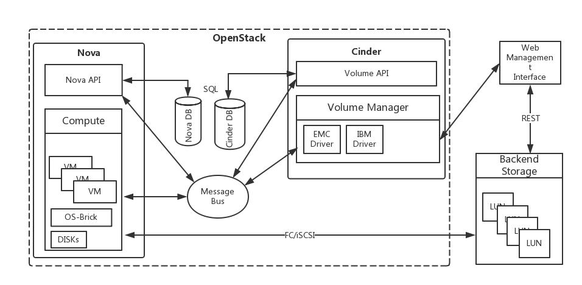
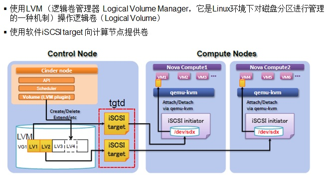
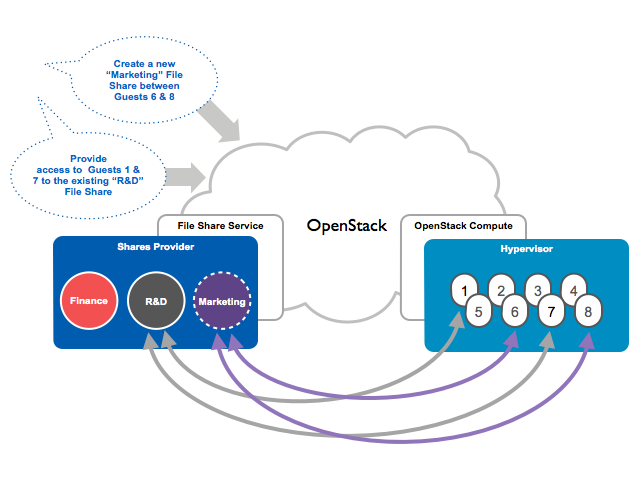

# openstack 存储项目
项目	| 组件	| 描述	
---|---|---|---
Swift	| Object Storage as a service |	对象存储	
Glance |	Image as a service	| VM 磁盘镜像存储和管理
Cinder	| Block Storage as a service	| 块存储	
Manila | | 文件共享存储 | 

# 块存储 Cinder
 * Nova 中的部分持久性块存储功能（Nova-Volume）分离了出来，独立为新的组件 Cinder。主要核心是对卷的管理，允许对卷、卷的类型、卷的快照进行处理。它并没有实现对块设备的管理和实际服务，而是为后端不同的存储结构提供了统一的接口，不同的块设备服务厂商在 Cinder 中实现其驱动支持以与 OpenStack 进行整合。
- 是一个资源管理系统，负责向虚拟机提供持久块存储资源
- 把不同的后端存储进行封装，向外提供统一的API
- 不是新开发的块设备存储系统，而是使用插件的方式，结合不同后端存储的驱动提供块存储服务。

## 调度器 Scheduler
cinder-scheduler的用途是在多backend环境中决定新建volume的放置host：
1. 首先判断host的状态，只有service状态为up的host才会被考虑。
2. 创建volume的时候，根据filter和weight算法选出最优的host来创建volume。

### 过滤器 Filters
- AvailabilityZoneFilter，会判断cinder host的availability zone是不是与目的az相同，不同则被过滤掉。
- CapabilitiesFilter，会检查host的属性是否和volume type中的extra specs是否完全一致，如volume_backend_type，不一致则被过滤掉。
- CapacityFilter，会判断host上的剩余空间 free_capacity_gb 大小，确保free_capacity_gb 大于volume 的大小，不够则被过滤掉。

## 卷管理Volumes
支持的卷操作：
- 创建/删除
- 挂载/分离
- 扩容
- 快照
- 迁移
- 备份

## Cinder Volume - 共享存储
实现方式：调用后端共享存储的管理接口，Driver一般由存储厂商开发。

Cinder 支持的存储矩阵:
https://wiki.openstack.org/wiki/CinderSupportMatrix

## Cinder Volume - 本地存储
通过软件iSCSI Target将本地逻辑卷（LVM）共享给虚拟机使用。

# 镜像管理Glance

# 对象存储Swift
Swift提供了弹性可伸缩、高可用的分布式对象存储服务。用于永久类型的静态数据的长期存储，这些数据可以检索、调整，必要时进行更新。
- 优点：稳定，适合异地部署
- 缺点：由于代理架构导致传输速度低、延时高，

# 文件共享Manila
Note: 根据IDC 2012数据，65%的数据存储是以文件的形态存在的，大量传统应用需要使用文件系统作为存储媒介。现在大量企业应用往云平台上迁移，自然对传统NAS服务在虚拟化环境下的实现有强烈的需求，那么在OpenStack平台上，如何实现文件共享服务呢？

## Manila的通用驱动方式
1. 通过Nova创建一台虚拟机(Service VM)
2. 通过Cinder创建一个Volume
3. 将Volume挂载到Service VM上
4. Service VM格式化这个Volume，用它作为共享目录，对外提供NFS/CIFS共享服务。

面临的问题：
- 认证
- 网络隔离
- 性能

