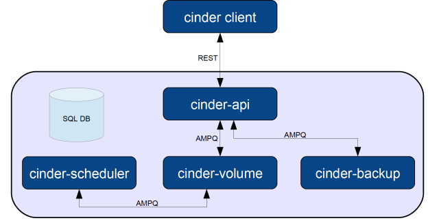
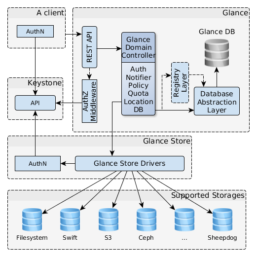

## openstack 存储项目
项目	| 组件	| 描述	
---|---|---|---
Swift	| Object Storage as a service |	对象存储	
Glance |	Image as a service	| VM 磁盘镜像存储和管理
Cinder	| Block Storage as a service	| 块存储	
Manila | | 文件共享存储 | 


## 块存储 Cinder
 * Nova 中的部分持久性块存储功能（Nova-Volume）分离了出来，独立为新的组件 Cinder。主要核心是对卷的管理，允许对卷、卷的类型、卷的快照进行处理。它并没有实现对块设备的管理和实际服务，而是为后端不同的存储结构提供了统一的接口，不同的块设备服务厂商在 Cinder 中实现其驱动支持以与 OpenStack 进行整合。
- 是一个资源管理系统，负责向虚拟机提供持久块存储资源
- 把不同的后端存储进行封装，向外提供统一的API
- 不是新开发的块设备存储系统，而是使用插件的方式，结合不同后端存储的驱动提供块存储服务。


## Cinder 架构
- cinder-api，对外接口
- cinder-scheduler，将请求路由到合适的卷服务
- cinder-volume，管理块存储设备
- cinder-backup，将cinder卷备份到不同备份后端



## 调度器 Scheduler
cinder-scheduler的用途是在多backend环境中决定新建volume的放置host：
1. 首先判断host的状态，只有service状态为up的host才会被考虑。
2. 创建volume的时候，根据filter和weight算法选出最优的host来创建volume。


### 过滤器 Filters
- AvailabilityZoneFilter，会判断cinder host的availability zone是不是与目的az相同，不同则被过滤掉。
- CapabilitiesFilter，会检查host的属性是否和volume type中的extra specs是否完全一致，如volume_backend_type，不一致则被过滤掉。
- CapacityFilter，会判断host上的剩余空间 free_capacity_gb 大小，确保free_capacity_gb 大于volume 的大小，不够则被过滤掉。


## 卷管理Volumes
支持的卷操作：
- 创建/删除
- 挂载/分离
- 扩容
- 快照
- 迁移
- 备份


## Cinder Volume - 本地存储
通过软件iSCSI Target将本地逻辑卷（LVM）共享给虚拟机使用。


## Cinder Volume - 共享存储
实现方式：调用后端共享存储的管理接口，Driver一般由存储厂商开发。


- Cinder 支持的存储矩阵:
https://wiki.openstack.org/wiki/CinderSupportMatrix


## Cinder Volume - 共享存储


# 镜像管理Glance
>Glance是客户端-服务器架构，为用户提供REST API接口，内部分层完成不同操作。所有的文件操作用glance_store库完成，负责与外部存储后端和本地文件系统交互，提供统一接口。




### Glance组件
| 服务名称 | 配置文件| 日志位置 | 运行节点 |
|------|----|----|----|
| openstack-glance-api | /ect/glance/glance-api.conf |/var/log/cinder/api.log | 控制节点|
| openstack-glance-registry | /ect/glance/glance-registry.conf | /var/log/cinder/registry.log | 控制节点|


## 镜像描述符
使用URI作为镜像唯一标识。
```
<Glance Server Location>/images/<ID>
```
- 默认存放路径: /var/lib/glance


## 镜像状态
- 排队（queued），registry中已经为镜像保留了标识符，但数据还没开始上传。
- 保存（saving），镜像原始数据正在上传。
- 可用（active），镜像上传完成。
- 不可用（deactivated），非管理员用户不能访问镜像，导出、克隆等需要镜像数据的操作也不能用。
- 取消（killed），镜像上传过程中发生错误，镜像不可读。
- 删除（deleted），Glance中残留镜像信息，但已不可用。该状态镜像会被自动清除。
- 等待删除（pending_delete），与delete类似，但还没删除镜像数据，该状态不能恢复。


## 磁盘与容器格式

向Glance添加镜像时，需要指定虚拟机镜像的磁盘格式和容器格式（container）。

## 磁盘格式
raw，vhd，vmdk，vdi，iso，qcow2,aki，ari，ami。

## 容器格式
镜像是否包含虚拟机相关的元数据，不被Glance直接使用。
bare，ovf，aki，ari，ami，ova。

# 对象存储Swift
Swift提供了弹性可伸缩、高可用的分布式对象存储服务。用于永久类型的静态数据的长期存储，这些数据可以检索、调整，必要时进行更新。
- 优点：稳定，适合异地部署
- 缺点：由于代理架构导致传输速度低、延时高，



# 文件共享Manila
Note: 根据IDC 2012数据，65%的数据存储是以文件的形态存在的，大量传统应用需要使用文件系统作为存储媒介。现在大量企业应用往云平台上迁移，自然对传统NAS服务在虚拟化环境下的实现有强烈的需求，那么在OpenStack平台上，如何实现文件共享服务呢？


## Manila的通用驱动方式
1. 通过Nova创建一台虚拟机(Service VM)
2. 通过Cinder创建一个Volume
3. 将Volume挂载到Service VM上
4. Service VM格式化这个Volume，用它作为共享目录，对外提供NFS/CIFS共享服务。


面临的问题：
- 认证
- 网络隔离
- 性能


