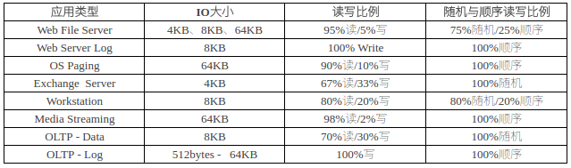

# 性能指标
- IOPS(I/Os per second)，系统在单位时间内能处理的最大I/O频度，一般由整列控制器决定。
- 吞吐量(Throughput)，单位时间内最大的I/O流量，取决于整个存储系统。

不同类型应用需要的性能指标是不同的：
- 大文件持续传输型的应用需要的时充分的带宽性能
- 小文件随机读写应用则需要足够的IOPS

带宽 = IO大小 × IOPS

## 带宽

## IOPS计算
影响IOPS的因素：
1. 磁盘旋转延迟时间（rotational latency），在磁道之间移动磁头所花费的时间
2. 磁头寻道时间（seek time），盘片将数据旋转至磁头下的时间
3. 数据传输时间（data transfer），磁盘带宽

硬盘转速 | Read IOPS(4k)
---|---
7200rpm | 80
10000rpm | 150
15000rpm | 180
Intel 530 | 40k
Intel 730 pci-e | 400k

注：理论IOPS值是按平均延时计算，并不是极限值。

> 响应时间 = （队列长度+1）*平均响应时间

# 性能测试工具

测试工具 | 适用平台 | 测试内容 | 说明 | 下载地址 
--- | --- | --- | --- | ---
IOMeter | Linux，Windows | 文件系统、裸设备 | | http://www.iometer.org/doc/downloads.html
FIO | Linux，Windows | 文件系统、裸设备 | | 
 IOZone | Linux，Windows | 文件系统 | | http://www.iozone.org/
 dd | Linux | 文件系统、裸设备 | | 系统自带
 IOZone | Linux，Windows | 文件系统 | | 
SQLIO | Windows | 文件系统 | 模拟SQL Server I/O活动 | http://www.microsoft.com/en-us/download/details.aspx?id=20163
ORION | Windows | 文件系统 | 模拟Oracle数据库IO | 
http://www.oracle.com/technetwork/cn/topics/index-088165-zhs.html

# 测试影响因素
- 读Read/写Write
  - 机械硬盘，顺序读写性能相近，但由于缓存的作用，写性能可能更好；如果使用RAID5,写数据有惩罚，读性能更好。
  - SSD，写数据会引起块擦除，读更快
- 顺序Sequential IO/随机Random IO
  - 机械硬盘，由于寻道时间，顺序读写比随机读写快很多。
  - SSD，差别不大，但顺序读写一般还是快一点。
- 块大小
  - 单次写入的数据块大（如1MB），IO请求次数少，且块内部一般连续，性能会好点。但当块很大时（如1GB），系统会拆分成小的IO发下去，性能并不会进一步改善。
- 缓存
  - 写缓存较大时，刚开始的性能值会非常大，使用Direct IO方式可以避免缓存影响。但大多数应用场景下，缓存是需要使用的，可以把最开始一段时间的数据剔除掉。
- 同步/异步IO
  - 异步测试结果一般比较好
- 

## 应用存储IO类型

## Little Law

## FIO

## IOMeter
https://community.emc.com/docs/DOC-24307

