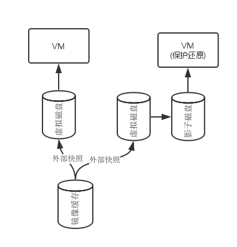

## 名词解释
- Image，镜像，Glance管理的基本元素，业务层面称为模板
- Volume，卷，Cinder管理的基本元素，业务层面称为虚拟磁盘
- Image Cache，镜像缓存，特殊的卷，镜像在特定存储上的副本
- 桌面，即虚拟机，包含计算、网络、存储资源



## 存储组件
- auxo-storage
- cinder
- glance


## auxo-storage
- 为前端提供存储添加/删除接口
- 配置Cinder服务
- 定期获取存储容量等信息
- 创建HA卷
- 存储状态管理


## 存储添加
- 存储名称
- 存储用途，决定存储初始化的方式
 - 磁盘镜像，创建VG，逻辑卷方式使用
 - 文件共享，格式化为文件系统
- 存储管理节点，对应cinder-volume运行的节点
- 存储类型
 - iSCSI，需要发现、登录，然后选择LUN
 - FC，直接选择LUN


## 存储删除
- 什么也没做


### 注意事项
- 存储控制节点需要在物理上能够访问存储，存储IP/光纤连接
- LUN使用要规划好，不能在不同测试环境同时使用
- 删除已使用的存储，再次添加前需要先退出登录（iSCSI）/重新加载HBA卡驱动（FC）或重启服务器
- 存储（Target）端配置修改后，本地服务器也需要重新登录或重启


# 虚拟机存储
- 本地存储
 - 服务器安装操作系统时规划，如果有多块硬盘，需配置RAID或使用逻辑卷管理。
  - 性能型，SSD硬盘挂载到/opt/ssd目录
  - 容量型，SATA/SAS硬盘挂载到/opt/sata目录


- iSCSI存储
 - 存储管理界面
 - 输入存储IP，发现IQNs
 - 选择IQN，登录获取LUNs
 - 选择LUN，初始化卷，创建VG或格式化


- FC存储
 - 存储管理界面


## 公共存储管理
将共享存储挂载到本地文件系统使用。
- 镜像目录，控制节点
 - /opt/glance/images/remotefs，后端镜像存放路径
 - /opt/nfs/iso/remotefs，系统ISO、软件
 - /opt/template，前端使用的镜像模板存放路径
- 临时缓存目录，计算节点
 - /var/lib/cinder/conversion，从镜像创建虚拟机磁盘时用到的临时目录


## 公共存储管理
- 挂载步骤
 1. 先将分区挂载到/mnt/<fs-uuid>
 2. 再将子目录挂载到相应目录

- 目的
 1. 源多个子目录，保证内容隔离，
 2. 目标子目录，保证原本地内容仍可访问


# Cinder
- Cinder架构


# Cinder组件
| 服务名称 | 配置文件| 日志位置 | 运行节点 |
|------|----|----|----|
| openstack-cinder-api | /ect/cinder/cinder.conf | /var/log/cinder/api.log | 控制节点|
| openstack-cinder-scheduler | /ect/cinder/cinder.conf | /var/log/cinder/scheduler.log | 控制节点|
| openstack-cinder-volume | /ect/cinder/cinder.conf | /var/log/cinder/volume.log | 控制/计算节点|


## Cinder配置文件
- 配置文件路径
 - /etc/cinder/cinder.conf
- 全局配置
- 存储配置


### 全局配置
- 默认配置
```
[DEFAULT]
storage_availability_zone = 4746c07b-545e-45c9-8c67-4cf215dbfa30
quota_gigabytes = -1
verbose = True
quota_backups = -1
scheduler_default_filters = TypeFilter,AvailabilityZoneFilter,CapacityFilter
enabled_backends = storage-2684de03-f940-4519-8f41-daeb9616b0ca,storage-009af686-9436-4a3b-8c48-6eac8f3483f8
glance_host = 192.168.65.11
enable_force_upload = True
```
- 消息队列配置
- 数据库配置


### 本地存储配置
```
[storage-2684de03-f940-4519-8f41-daeb9616b0ca]
mount_point = /opt/sata
image_base_path =
volume_backend_name = storage-2684de03-f940-4519-8f41-daeb9616b0ca
volume_type = qcow2
volume_driver = cinder.volume.drivers.local.LocalFileDriver
image_volume_cache_enabled = True
image_format = qcow2
```
- mount_point，本地存储挂载的目录。目前仅ssd和sata两个。
- storage-存储ID，存储后端名称，对应cinder的volume-type
- image_base_path，该存储的镜像缓存路径，如果为空，表示该存储自身。


### 共享存储配置
```
[storage-230fc138-a867-4bbe-b96b-3395f17818f1]
volume_driver = cinder.volume.drivers.lvm.LVMSANDriver
volume_backend_name = storage-230fc138-a867-4bbe-b96b-3395f17818f1
iscsi_protocol = iscsi
iscsi_port = 3260
iscsi_ip_address = 10.0.20.1
iscsi_helper = iscsisan
iscsi_target_prefix = iqn.2012-07.com.Sugon:alias.tgt0000.200000015555ee0d
target_lun = 14
volume_clear_size = 128
volume_group = 2b55ce3e-3338-458d-a773-7429a58e9a46
chap_username =
chap_password =
image_volume_cache_enabled = True
image_base_path =
image_format = qcow2
```
- storage-存储ID，存储后端名称，对应cinder的volume-type
- image_base_path，该存储的镜像缓存路径，如果为空，表示该存储自身。
- volume_group，存储LUN对应的VG名称，查看该vg是否正常可以判断存储添加是否成功。
- iscsi_helper，
    - iscsisan，ISCSI存储
    - fcsan，FC存储


### Cinder常用命令
- cinder help [sub-command] 查看命令帮助
- cinder create 创建卷
  -  [--source-volid <source-volid>]， 从另一个卷拷贝
  -  [--image-id <image-id>] [--image <image>] [--name <name>]， 从镜像创建
  -  [--volume-type <volume-type>]， 使用的存储
  -  [--availability-zone <availability-zone>]，可用域
  -  size，大小，单位G
- cinder availability-zone-list 列出所有可用域
- cinder list 列出所有卷
- cinder type-list 查看所有存储
- cinder service-list 查看存储服务状态
- cinder show <volume-id> 查看卷详细信息
- cinder delete <volume-id> 删除卷


# 镜像
>Glance是客户端-服务器架构，为用户提供REST API接口，内部分层完成不同操作。所有的文件操作用glance_store库完成，负责与外部存储后端和本地文件系统交互，提供统一接口。


### Glance组件
| 服务名称 | 配置文件| 日志位置 | 运行节点 |
|------|----|----|----|
| openstack-glance-api | /ect/glance/glance-api.conf |/var/log/cinder/api.log | 控制节点|
| openstack-glance-registry | /ect/glance/glance-registry.conf | /var/log/cinder/registry.log | 控制节点|


### 目录
用户上传的镜像存放目录：
 - /opt/glance/images 
 - /opt/glance/images/remotefs


### 上传镜像


1. 用户上传镜像文件。用户将已有的镜像文件上传到镜像服务器，默认保存到/opt/glance/images目录，生成的镜像文件名域镜像ID一致。
2. 基于镜像创建虚拟机（磁盘）。
    2.1 下载镜像。如果目标存储S1是第一次基于该镜像创建虚拟磁盘，则需先下载镜像文件到目标存储，并作为镜像缓存。果然镜像缓存已存在，则跳过该步骤。
    2.2 基于缓存镜像创建虚拟磁盘。以缓存镜像为Base，创建qcow2外部快照作为虚拟磁盘D1。
    2.3 挂载虚拟磁盘。虚拟磁盘创建完成后，虚拟机与磁盘建立连接并挂载使用。
3. 更新镜像。模板虚拟机更新后，差异文件即当前虚拟磁盘。该过程通过save_image()接口实现。
    3.1 创建临时镜像。为了便于不同服务器都能访问差异文件，则镜像服务上创建临时镜像L1作为入口。
    3.2 上传镜像文件。模板虚拟机与原始镜像在同一台服务器，上传实际上只是将差异文件所在卷路径加入临时镜像。
    3.3 更新本地镜像及缓存。根据临时镜像信息，拷贝差异文件，修改backing_file，提交回原始镜像和缓存镜像。
    3.4 更新远程缓存。其它服务器不能直接访问差异文件，需先通过下载临时镜像获取差异文件，然后按照步骤3.3更新缓存。
4. 重置模板虚拟机。镜像更新完成后，需要重置模板虚拟机磁盘，清除之前的增量内容。


### 通过ISO创建镜像



如果镜像模板通过ISO重新生成，过程略有不同。
1. 模板虚拟机使用的磁盘D1是独立创建，而不是基于某个镜像，所以没有Base。
2. 模板创建完成，保存镜像时，仅将虚拟磁盘的路径加入镜像I1，而没有真正上传。原虚拟磁盘D1同时作为该存储S1的缓存，上面再基于I1创建磁盘时，都是以D1作为Base。其它存储，如S2也基于I1创建磁盘，过程与之前的步骤一致。


### glance常用命令
- glance help [sub-command] 查看命令帮助
- glance image-list 列出所有镜像
- glance image-show <image-id> 查看镜像详细信息
- glance image-delete <image-id> 删除镜像
- glance image-create 创建镜像
  -  --container-format bare 必加
  -  [--disk-format <DISK_FORMAT>]  镜像格式，raw/qcow2/iso
  -  [--file <FILE>] 镜像文件
  -  [--progress]    显示进度
  -  [--property <key=value>] 可选，其它属性
  - [--name <NAME>] 镜像名称


