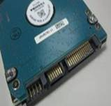
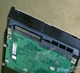
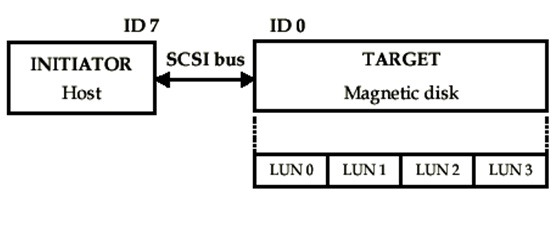
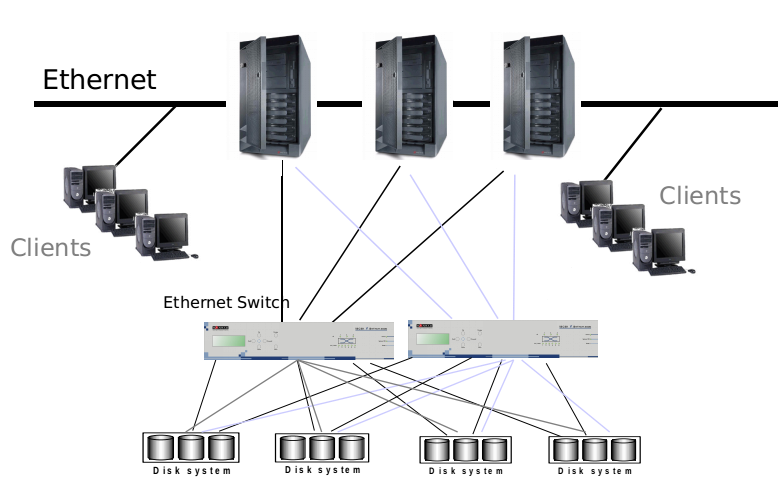
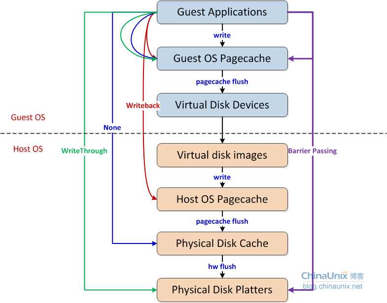

# 基本概念

# 存储系统
## 存储设备
- 磁盘控制器
- 硬盘
- HBA
- RAID


### 硬盘控制器
系统通过磁盘控制器操作磁盘。
硬盘接口类型：
- IDE(Intergrated Device Electronic)，并口磁盘，ATA硬盘
- SATA(Serial ATA)，串行硬盘，在安装、传输速率、功耗、抗干扰方面有优势。
- SCSI(Small Computer System Interface)，相对于ATA支持更多接口数量，并行处理能力强，CPU占用率低。
- SAS(Serial Attached SCSI)，性能更高，向下兼容SATA。
- 光纤通道，优越的性能、稳定的传输。


 



| 协议 | 速率 | 优点 | 缺点 |
|---|---|---|---|
| IDE | 133MB/s | 
| SATA II | 300MB/s |
| SATA III | 600MB/s |


工作模式：
- IDE模式，IDE兼容模式，SATA硬盘也支持。
- AHCI模式，高级控制器接口，支持热插拔、本地命令队列等高级功能。
- RAID模式，把多块硬盘组成一个硬盘组。


### HBA控制器


### RAID控制器
- 


# 存储连接技术


## DAS
直连存储（Direct Attached Storage）
- 优点
 - 低费用
 - 安装、使用简单
- 缺点
 - 不能共享
 - 连接距离有限
 - 升级困难
 - 缺乏较好的高科用性
- 适用场景
 - 小型机构存储解决方案


## NAS
网络附加存储（Network Attached Storage）
- 优点
 - 低费用
 - 安装、维护简单
 - 共享数据
 - 跨平台文件共享
 - 远程访问
 - 减轻服务器负担
- 缺点
 - 孤立的存储设备
 - 传输速率低，可能成为瓶颈
 - 不适合数据库存储
- 适用场景
 - 文件存储解决方案


## SAN
存储区域网络（Storage Area Network），独立于LAN的服务器端存储专用网络。


- 光纤通道交换机（FC Switch）
- 光纤通道卡（FC HBA），提供服务器或工作站连接到存储网络的接口


- 优点
 - 传输速度快，传输距离远
 - 高级特性

- 缺点
 - 孤立的存储设备

- 应用场景
 - 基于文件和数据块的中高端存储解决方案
 - LanFree Backup
 - ServerLess Backup
 - 集群（可实现多节点）
 - 服务器/应用系统存储整合
 - 异地灾备
 - 同步与异步镜像
 - 分级存储（HSM）


## iSCSI

### SCSI系统
SCSI是一套完整的数据传输协议，其主要功能是在主机和存储设备之间传送命令、状态和块数据。操作系统对外部设备（如磁盘、磁带、光盘、打印机等）的I/O操作均可以通过SCSI协议来实现，一般情况下，SCSI协议都嵌入到设备驱动器或者主机适配器的板载逻辑中。


- SCSI Initiator，发起SCSI会话的一端，发送SCSI命令。
- SCSI Target，等待Initiator的命令，提供传输数据。通常向Initiator提供一个或多个LUNs。


### iSCSI协议
iSCSI是IETF提出的经TCP/IP/以太网传送SCSI指令的协议。
- iSCSI 协议经由TCP/IP协议栈（在IP之上的第四层< 传输>）传送本地SCSI命令及数据。
- 通过iSCSI协议，标准的SCSI命令和数据将被封装成一个以iSCSI头在先的连续字节串，该字节串被送到TCP/IP层，并被分解成适合网络传输的数据组后，交给主机和适用与iSCSI协议的存储设备
- 如果发出一个读数据的请求，则从物理磁盘中检索出数据，将其重新封装成iSCSI字节串后送到提出请求的主机
- 整个过称对用户和文件系统是透明的


**优点**
- 可连接性能超群，基于现有以太网络架构，可自然扩充到LAN、MAN、WAN，是远程数据传输的最佳方案。
- 提供与FC同级别的高可用
- 可加强的性能及高可用性、扩展性
- 虚拟存储与集中管理，易于整合
- 低整体成本
- 超远传输距离





### iSCSI Target

- portal，
- iqn，
- 


## FCP


# 文件系统

文件是已建立索引的块的序列。块从索引节点映射到它们所代表的文件的逻辑偏移量。


## 分区
- mbr
- gpt


## 本地文件系统
- EXT
- XFS
- NTFS


## 网络文件系统
- NFS
- CIFS


## 集群文件系统
- GlusterFS
- GFS


## 稀疏文件
具有一个或多个未映射到数据块的索引的文件称为稀疏分配或稀疏文件。稀疏文件将有一个与之相关的大小，但是它将不会有分配用于满足大小需求的所有数据块。


# RAID
独立硬盘冗余阵列（RAID, Redundant Array of Independent Disks），旧称廉价磁盘冗余阵列（Redundant Array of Inexpensive Disks），简称磁盘阵列。其基本思想就是把多个相对便宜的硬盘组合起来，成为一个硬盘阵列组，使性能达到甚至超过一个价格昂贵、容量巨大的硬盘。根据选择的版本不同，RAID比单颗硬盘有以下一个或多个方面的好处：增强数据集成度，增强容错功能，增加处理量或容量。另外，磁盘阵列对于电脑来说，看起来就像一个单独的硬盘或逻辑存储单元。分为RAID-0，RAID-1，RAID-1E，RAID-5，RAID-6，RAID-7，RAID-10，RAID-50，RAID-60。


```
RAID档次	最少硬盘	最大容错	可用容量	读取性能	写入性能	安全性	目的	应用产业
单一硬盘	(参考)	0	1	1	1	无	

JBOD	1	0	n	1	1	无（同RAID 0）	增加容量	个人（暂时）存储备份
0	2	0	n	n	n	一个硬盘异常，全部硬盘都会异常	追求最大容量、速度	视频剪接缓存用途
1	2	n-1	1	1	1	最高，一个正常即可	追求最大安全性	个人、企业备份
5	3	1	n-1	n-1	n-1	高	追求最大容量、最小预算	个人、企业备份
6	4	2	n-2	n-2	n-2	安全性较RAID 5高	同RAID 5，但较安全	个人、企业备份
10	4	n/2	n/2	n	n/2	安全性高	综合RAID 0/1优点，理论速度较快	大型数据库、服务器
```

# 虚拟磁盘




## 镜像格式
### RAW
优点：
简单，可移植性好。

缺点：
占磁盘空间，不支持快照。


### QCOW
它也是可以用一个文件的形式来表示一块固定大小的块设备磁盘。与普通的 raw 格式的镜像相比，有以下特性：
- 更小的空间占用，即使文件系统不支持空洞(holes)；
- 支持写时拷贝（COW, copy-on-write），镜像文件只反映底层磁盘的变化；
- 支持快照（snapshot），镜像文件能够包含多个快照的历史；
- 可选择基于 zlib 的压缩方式
- 可以选择 AES 加密


### VMDK
VMWare


### VHD
VHD/VHDX 是HyperV 适用的虚拟磁盘格式，支持COW。


## 缓存格式

| Caching Options | 描述 | 适用场景 |
|---|---|---|
| none | 虚拟机I/O不在主机上缓存，但可能在writeback模式硬盘缓存上|大量I/O请求，支持迁移 | 
| writethrough |虚拟机I/O缓存在主机，同时也写入物理介质 | 少量I/O请求 |
| writeback |虚拟机I/O缓存在主机 | | 


## 磁盘控制器

### IDE
完全软件模拟的传统PC存储控制器。
优点：
无需安装额外驱动，兼容性好
缺点：
性能差


### Virtio
半虚拟化的磁盘控制器，让虚拟机的操作系统与内核的虚拟化层直接通信。

优点：
性能好
缺点：
操作系统需要安装额外驱动。


## raw


## 


# 多路径

- 冗余，A/P模式，使用一半的路径，当前路径出现故障即切换到备选路径。
- 提高性能，A/A模式，I/O以round-robin方式通过所有路径。


Active/Passive模式


故障点：
- HBA
- FC线
- SAN交换机
- 阵列控制器端口


Active/Active模式


# 分布式存储
## 分布式存储系统特点：
- 可扩展 。分布式存储系统可以扩展到几百台甚至几千台的集群规模，而且，随着集群规模的增长，系统整体性能表现为线性增长。
- 低成本 。分布式存储系统的自动容错、自动负载均衡机制使其可以构建在普通PC 机之上。另外，线性扩展能力也使得增加、减少机器非常方便，可以实现自
动运维。
- 高性能 。无论是针对整个集群还是单台服务器，都要求分布式存储系统具备高性能。
- 易用 。分布式存储系统需要能够提供易用的对外接口，另外，也要求具备完善的监控、运维工具，并能够方便地与其他系统集成


## 分布式存储系统主要技术：

- 数据分布 ：如何将数据分布到多台服务器才能够保证数据分布均匀?数据分布到多台服务器后如何实现跨服务器读写操作?
- 一致性 ：如何将数据的多个副本复制到多台服务器，即使在异常情况下，也能够保证不同副本之间的数据一致性?
- 容错 ：如何检测到服务器故障?如何自动将出现故障的服务器上的数据和服务迁移到集群中其他服务器?
- 负载均衡 ：新增服务器和集群正常运行过程中如何实现自动负载均衡?数据迁移的过程中如何保证不影响已有服务?
- 事务与并发控制 ：如何实现分布式事务?如何实现多版本并发控制?
- 易用性 ：如何设计对外接口使得系统容易使用?如何设计监控系统并将系统的内部状态以方便的形式暴露给运维人员?
- 压缩/解压缩 ：如何根据数据的特点设计合理的压缩 / 解压缩算法?如何平衡压缩算法节省的存储空间和消耗的 CPU 计算资源?


## 分布式存储分类：
- 分布式文件系。存储大量的图片、照片、视频等非结构化数据，这类数据以对象的形式组织，对象之间没有关联，这样的数据一般称为  Blob（Binary Large Object，二进制大对象）数据。如GFS。
- 分布式键值系统。存储关系简单的半结构化数据（如html文档），它只提供基于主键的 CRUD(Create/Read/Update/Delete)功能，即根据主键创建、读取、更新或者删除一条键值记录。如Memcache。
- 分布式表格系统。存储关系较为复杂的半结构化数据，与分布式键值系统相比分布式表格系统不仅仅支持简单的 CRUD 操作，而且支持扫描某个主键范围。分布式表格系统以表格为单位组织数据，每个表格包括很多行，通过主键标识一行，支持根据主键的 CRUD 功能以及范围查找功能。如Google Bigtable。
- 分布式数据库。一般是从单机关系数据库扩展而来，用于存储结构化数据。分布式数据库采用二维表格组织数据，提供 SQL 关系查询语言，支持多表关联，嵌套子查询等复杂操作，并提供数据库事务以及并发控制。如MySQL Sharding。

